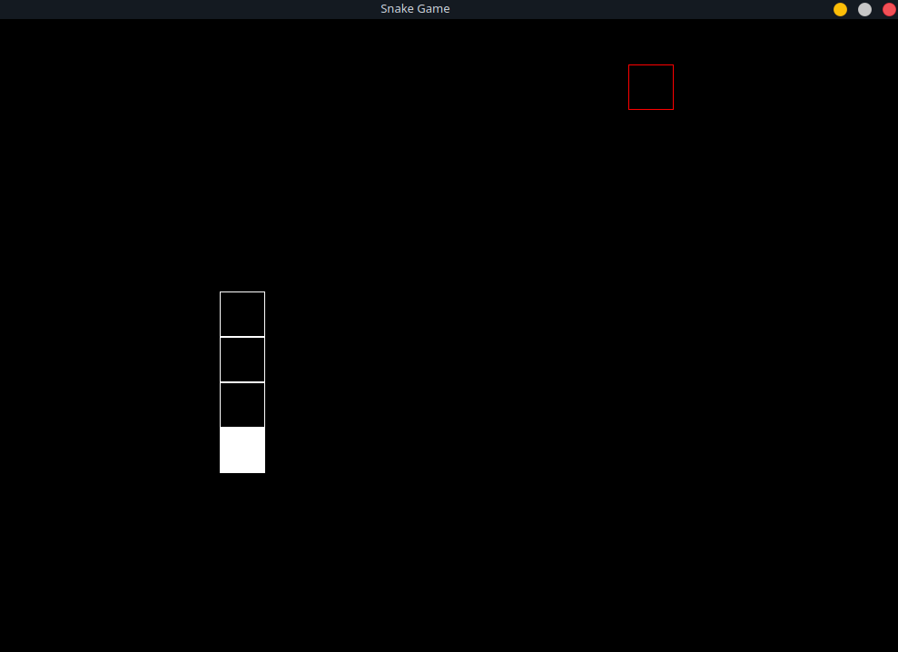

# SDL2 Snake
Simple snake game written in C++ using SDL2.

To compile:
`g++ snake.cpp -lSDL2 -lSDL2_ttf -o snake`

To run:
`./snake`

Requires [SDL2](https://www.libsdl.org/) and [SDL2_TTF](https://www.libsdl.org/projects/SDL_ttf/).

TO-DO:
- Add (high)score system
- Option to change difficulty
- Main menu
